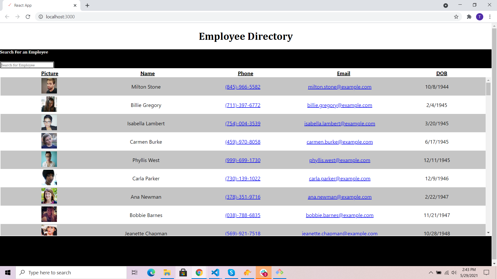

# Employee-Directory

## Deployed Link

[Live Link](https://taroche.github.io/Employee-Directory/)

## Table of Contents

* [Purpose](#Purpose)

* [Technologies](#Technologies)

* [Installation](#Installation)

## Purpose

A SPA (Single Page Application) that allows the user to sort and filter employees returned from the API. Sortable columns are the following: name, email, phone and birthday. Along with being able to sort columns the user also has a search feature where they can enter a name to search and it will return matching criteria. 

## Technologies

* ***Nodejs***
* ***React***
* ***BootStrap*** 
* ***JavaScipt***
* ***CSS***
* ***HTML***
* ***API***

## Installation

The live deployed app will take care of the user (no instructions needed).

However if it was needed to run the application locally:

1. Clone the repository on a local machine.
2. Open the apps directory and run a `npm install` to get all dependencies.
3. In the command line run `npm start` to get the server up and running, with React upon entering the previous command a new window or tab will launch with your browser.